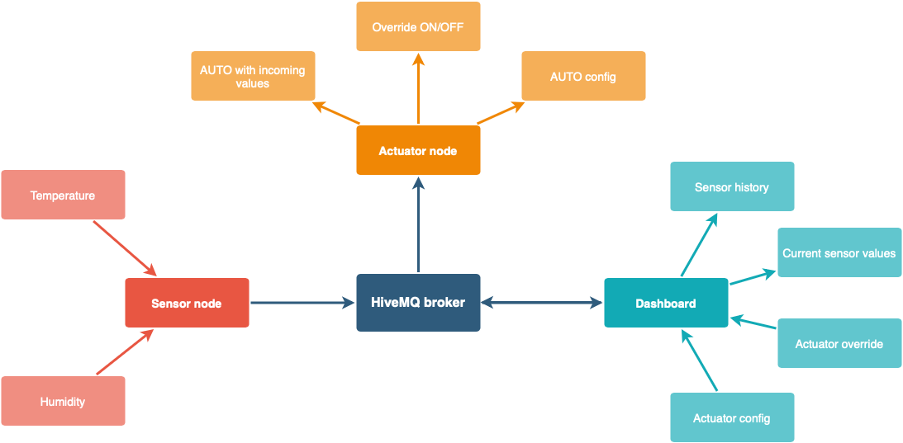

# Sensor Side
## Introduction

## Project Flowchart

## Links to other documentation and repos
- github dashboard: https://github.com/VerbruggenD/IOT_project_dashboard
- github psoc: https://github.com/VerbruggenD/IOT_humidity_project
- dockerhub dashboard: https://hub.docker.com/repository/docker/dieterverbruggen/iot_dashboard/general
- google drive folder: https://drive.google.com/drive/folders/1XOHH8MmAhiO1N2XTn9_pA3xuGM-f5_lv?usp=sharing

## MQTT and different topics
We used MQTT to communicate between our devices, in total we used 4 different topics to post different information:
1. sensor/temperature:

    >This is the topic where the temprerature values from the sensor are posted.

2. sensor/humidity:

    >This is the topic where the humidity values from the sensor are posted and the dehumidifier is subscribed to this topic to get the current humidity.
