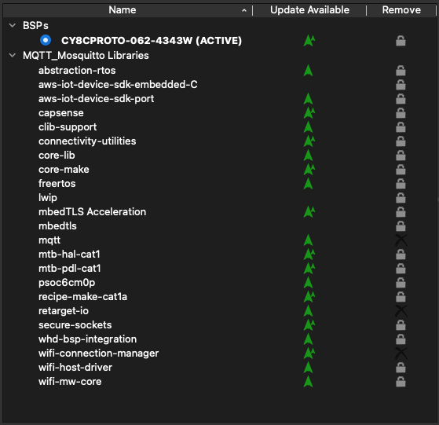

# Sensor Side
## Introduction
For the sensor for this project we firstly chose the BME680 from Bosch, it is an environmental sensor that measures a lot more than just humidity or temperature. After struggling with the PSOC way to enable communication like I2C or SPI we gave up on this idea. Then we decided to use the DHT11 sensor which we avoided in the beginning because a very obvious reason. It uses a proprietary one wire interface, this interface ended up being easier to implement then standard SPI communication.

## Project Flowchart

## Links to other documentation and repos
- github dashboard: https://github.com/VerbruggenD/IOT_project_dashboard
- github psoc: https://github.com/VerbruggenD/IOT_humidity_project
- dockerhub dashboard: https://hub.docker.com/repository/docker/dieterverbruggen/iot_dashboard/general
- google drive folder: https://drive.google.com/drive/folders/1XOHH8MmAhiO1N2XTn9_pA3xuGM-f5_lv?usp=sharing

## MQTT topics used by the sensor node
We used MQTT to communicate between our devices, in total we used 4 different topics to post different information but the sensor only uses 2:
1. sensor/temperature:

    >The temperature from the DHT sensor is posted here.

2. sensor/humidity:

    >The humidity from the DHT sensor is posted here. The actuator (dehumidifier) is subscribed to this topic to turn on and off based on the threshold.
    >The threshold is set by the dashboard and is by default 50%.

## Libraries used:

## Low power implementation
For the low power implementation we tried some different methods, even tried offloading the wifi connection and using an mqtt filter for generating an interrupt for returning from deepsleep. After all this trail and a lot of error, we came to the conclusion that just using sleep is enough and the best implementation for practical use. The interrupts from wifi, timer and hardware button can wake up the PSOC6 from sleep.